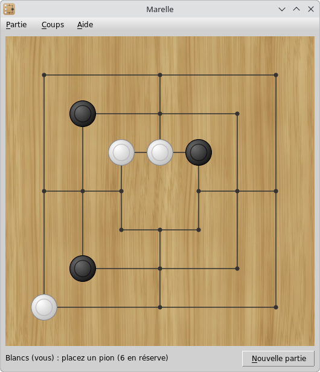

# Marelle

*MSEgui* implementation of Nine Men's Morris.

The game logic comes from [Mérelles](https://codeberg.org/rchastain/merelles), a C/SDL program by [paul-maxime](https://github.com/paul-maxime/merreles).

The rule about taking pieces from mills comes from [Morris](https://github.com/farindk/morris) by Dirk Farin.

## Screenshot



## Rules

### Board and pieces

The board is made of three nested squares joined by four lines at the middle of their sides. The pieces stand on the 24 points where lines meet or end. Two points are neighbours when a line joins them without passing through another point.

Each player has nine pieces: White and Black. White plays first, then the players take turns.

### Mills

A mill is a row of three pieces of the same colour along a line: one side of a square, or one of the four lines joining the squares. There are 16 possible mills.

Each time a player forms a mill, by placing or moving a piece, they remove one opponent piece from the board. The removed piece is out of the game for good. A mill can be opened and closed again later: every new closing counts.

A piece belonging to a mill cannot be taken, unless all the opponent pieces belong to mills. In that case, any of them can be taken.

A move closing two mills at once only allows one piece to be taken.

### Placing

At first, the players place their pieces one at a time on any free point. This phase ends when both players have placed their nine pieces.

### Moving

Then, on each turn, the player moves one of their pieces along a line to a neighbouring free point. Pieces cannot jump over other pieces.

### Flying

A player left with three pieces may move a piece to any free point of the board, not only to a neighbouring one.

### End of the game

A player loses the game when, at their turn to move:

- they have fewer than three pieces, so they can no longer form a mill;
- or none of their pieces can move, all of them being blocked.

The program does not detect draws: when the game goes around in circles, start a new game.

## Usage

Click a free point to place a piece. To move a piece, drag it to its destination, or click it (it gets a green circle and its possible destinations are marked with green dots), then click the destination. After a mill, the pieces that can be taken have a red circle: click one of them.

The status line shows whose turn it is, what to do and how many pieces are left to place.

For now, the computer plays a random legal action: it is only a placeholder for a real opponent.

## Building

You need Free Pascal and [MSEgui](https://github.com/mse-org/mseide-msegui):

```Bash
git clone https://github.com/rchastain2/marelle.git
cd marelle
git clone https://github.com/mse-org/mseide-msegui.git --single-branch --depth 1
make
```

Or provide the path to an existing MSEgui repository:

```Bash
make MSEDIR=/path/to/mseide-msegui/
```

Or open *marelle.prj* in MSEide.

## Credits

- Wood texture from [Wood Texture Tiles](https://opengameart.org/content/wood-texture-tiles)
